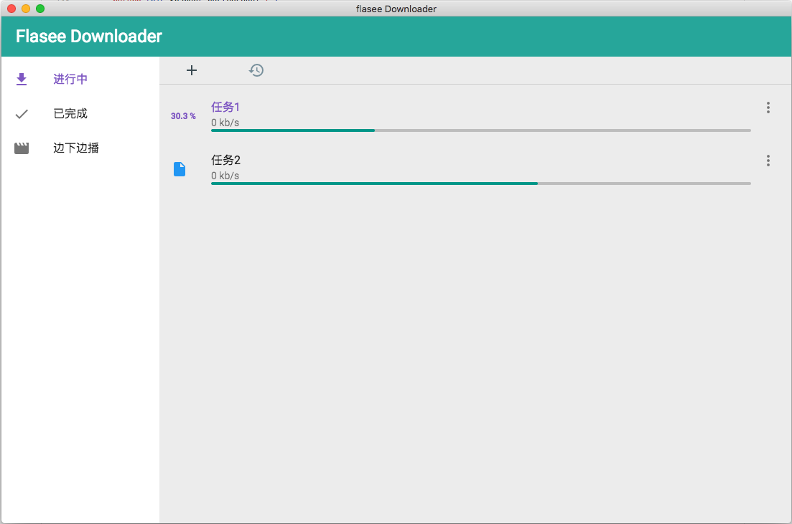

# Flasee


> A fast downloader implements by electron and vue.js



## Support protocol

* BT .torrent
* Magnet link

#### Build Setup

``` bash
# install dependencies
npm install

# serve with hot reload at localhost:9080
npm run dev

# build electron application for production
npm run build


# lint all JS/Vue component files in `src/`
npm run lint

```

---

# Thanks

* [electron-vue](https://github.com/SimulatedGREG/electron-vue)
* [vue-cli](https://github.com/vuejs/vue-cli)
* [web-torrent](https://github.com/webtorrent/webtorrent)
